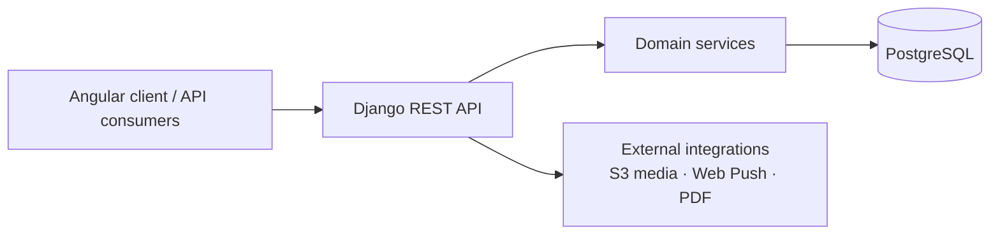

# Auto Repair Shop SaaS API

Multi-tenant SaaS backend for auto repair shop operations. Built with Django REST Framework and PostgreSQL. Companion frontend: [auto-repair-shop-front](https://github.com/jlrodriguezalvarado/auto-repair-shop-front).

> Originally developed on GitLab and later migrated to GitHub.

## Overview

Portfolio / production-shaped API that models a real workshop product: tenant isolation by company, role-based access, JWT auth, and domain modules for customers, vehicles, work orders, quotes, receipts, and dashboard KPIs. Designed as the contract owner for the Angular client (OpenAPI / trailing-slash routes / decimal-safe payloads).

## Architecture



High-level layout:

```text
apps/
  company/ users/ customers/ vehicles/ catalog/
  work_orders/ estimates/ receipts/ notifications/ dashboard/
config/     settings (local / production)
deploy/     production Compose + Traefik notes
docker/     entrypoints and local tooling helpers
docs/       OpenAPI export and image placeholders
```

## Core Features

- Multi-tenancy by `company` (scoped querysets, cross-tenant FK rejection)
- RBAC: `SUPER_ADMIN`, Admin, Secretary, Mechanic, Customer
- JWT obtain / refresh (SimpleJWT)
- Customers and vehicles
- Work orders (assignment, status transitions, services/items)
- Quotes / estimates with PDF generation
- Receipts, partial payments, and balances (`Decimal`)
- Notifications (including Web Push / VAPID where configured)
- Dashboard tenant summary
- Soft-delete + restore patterns on key resources

## Tech Stack

| Layer | Choice |
|-------|--------|
| Runtime | Python 3.12, Django 5, DRF, SimpleJWT |
| DB | PostgreSQL 16 |
| Docs | drf-spectacular (Swagger / ReDoc) |
| PDF | ReportLab |
| Quality | pytest, pytest-django, coverage, Ruff |
| Deploy | Docker, Gunicorn, Traefik; optional S3 media |

## Security

- JWT auth; secrets via environment (never commit `.env` or PEMs)
- Tenant scoping before object lookup; RBAC permission classes on viewsets
- Soft-deleted companies block login/refresh for their users
- See [SECURITY.md](SECURITY.md) for reporting and hardening notes

## API Documentation

With the local stack running (`http://localhost:8001` by default):

- Swagger UI: `/api/schema/swagger-ui/`
- ReDoc: `/api/schema/redoc/`
- Exported schema: [`docs/openapi.yaml`](docs/openapi.yaml)

Main route groups:

- `/api/users/` — JWT (`/token/`, `/token/refresh/`), users, me, change password
- `/api/companies/` — companies (`SUPER_ADMIN`)
- `/api/company/` — current tenant company
- `/api/customers/profiles/` — customers
- `/api/vehicles/vehicles/` — vehicles
- `/api/catalog/services/` — service catalog
- `/api/work-orders/orders/` — work orders
- `/api/estimates/estimates/` — estimates + PDF
- `/api/receipts/receipts/` — receipts & payments
- `/api/dashboard/summary/` — tenant stats

## Development

Requires Docker and a shared Postgres on network `dev-tools` (see `docker-tools` / `DOCKER_TOOLS_DIR`). Helpers live under `docker/` (entrypoints, wait scripts, example standalone Compose).

```bash
cp --update=none .env.example .env
./start.sh
```

Stop with `./off.sh`. API default: `http://localhost:8001`.

Seed demo data (after migrate):

```bash
docker compose -f docker-compose.yml exec -T mechanics_api_app python manage.py seed_data
```

| User | Password | Role |
|------|----------|------|
| `superadmin` | `superadmin123` | `SUPER_ADMIN` |
| `admin` | `admin123` | `ADMIN` |
| `secretary` | `sec123` | `SECRETARY` |
| `mechanic` | `mech123` | `MECHANIC` |

Seed passwords are **demo-only**. Never reuse them outside local.

Multi-tenant migrations are **breaking** for older single-tenant DBs. New installs are fine; legacy DBs need wipe + migrate + seed. Details: [MIGRATIONS.md](MIGRATIONS.md).

```bash
docker compose -f docker-compose.yml exec -T mechanics_api_app python manage.py flush --noinput
docker compose -f docker-compose.yml exec -T mechanics_api_app python manage.py migrate --noinput
docker compose -f docker-compose.yml exec -T mechanics_api_app python manage.py seed_data
```

Local quality commands (host venv or inside the app container after `pip install -r requirements/local.txt`):

```bash
make lint            # ruff check apps config
make format-check    # ruff format --check apps config
make test            # pytest
make cov             # pytest + coverage
make check           # manage.py check
make migrations-check
```

Ruff is configured in `pyproject.toml` with a focused rule set so CI stays green on legacy code; expand with `ruff check --fix` over time. Prefer formatting new/edited files rather than mass-reformatting the tree in one PR.

Agent kit: `.agents/` policies and `.plans/` dated feature plans (`django-api`, `qa`).

## Testing

```bash
# Inside Compose (recommended — PostgreSQL parity)
docker compose -f docker-compose.yml exec -T mechanics_api_app bash -lc \
  'pip install -q -r requirements/local.txt && pytest --cov=apps --cov-report=term-missing -q'
```

Or on the host with `DATABASE_URL` pointing at Postgres and `DJANGO_SETTINGS_MODULE=config.settings.local`:

```bash
pytest --cov=apps --cov-report=term-missing -q
```

Critical coverage focuses on multi-tenancy, RBAC, JWT auth, estimate/receipt services, and API validation/pagination — not 100% line coverage.

CI runs the same checks via [`.github/workflows/ci.yml`](.github/workflows/ci.yml) (Ruff, Django check, makemigrations --check, pytest + coverage, PostgreSQL service).

## Deployment

Production uses Docker images, Gunicorn, and Traefik (Let's Encrypt) as described in [DEPLOY.md](DEPLOY.md). Copy `deploy/.env.example` → server `.env` with real secrets. Never commit `.env`, PEMs, or registry credentials.

## License

MIT — see [LICENSE](LICENSE).
